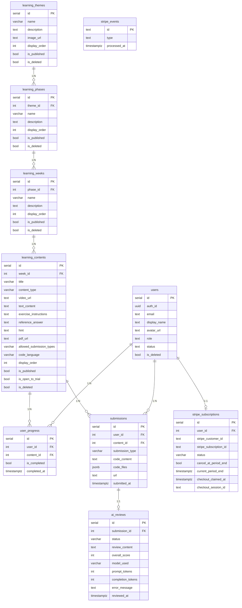

# データベース設計書

本書は、Web技術学習支援サービスのデータベース設計について記載する。

---

## 1. 概要

### 1.1 データベース基盤
- **DBMS**: PostgreSQL（Supabase マネージドサービス）
- **認証**: Supabase Auth（`auth.uid()` による認証ユーザー識別）
- **アクセス制御**: Row Level Security（RLS）
- **タイムゾーン**: TIMESTAMPTZ（タイムゾーン付きタイムスタンプ）

### 1.2 設計方針
- 論理削除方式（`is_deleted` フラグ）によるデータ保全
- 公開制御（`is_published` フラグ）によるコンテンツ管理
- `display_order` によるユーザー任意の表示順制御
- `updated_at` の自動更新トリガーによるデータ整合性の確保
- 外部キー制約 + `ON DELETE CASCADE` によるデータ一貫性の保証

---

## 2. ER図


```mermaid
erDiagram
    learning_themes ||--o{ learning_phases : "1:N"
    learning_phases ||--o{ learning_weeks : "1:N"
    learning_weeks ||--o{ learning_contents : "1:N"
    learning_contents ||--o{ user_progress : "1:N"
    learning_contents ||--o{ submissions : "1:N"
    users ||--o{ user_progress : "1:N"
    users ||--o{ submissions : "1:N"
    submissions ||--o| ai_reviews : "1:1"
    users ||--o| stripe_subscriptions : "1:1"

    learning_themes {
        serial id PK
        varchar name
        text description
        text image_url
        int display_order
        bool is_published
        bool is_deleted
    }
    learning_phases {
        serial id PK
        int theme_id FK
        varchar name
        text description
        int display_order
        bool is_published
        bool is_deleted
    }
    learning_weeks {
        serial id PK
        int phase_id FK
        varchar name
        text description
        int display_order
        bool is_published
        bool is_deleted
    }
    learning_contents {
        serial id PK
        int week_id FK
        varchar title
        varchar content_type
        text video_url
        text text_content
        text exercise_instructions
        text reference_answer
        text hint
        text pdf_url
        varchar allowed_submission_types
        varchar code_language
        int display_order
        bool is_published
        bool is_open_to_trial
        bool is_deleted
    }
    users {
        serial id PK
        uuid auth_id
        text email
        text display_name
        text avatar_url
        text role
        text status
        bool is_deleted
    }
    user_progress {
        serial id PK
        int user_id FK
        int content_id FK
        bool is_completed
        timestamptz completed_at
    }
    submissions {
        serial id PK
        int user_id FK
        int content_id FK
        varchar submission_type
        text code_content
        jsonb code_files
        text url
        timestamptz submitted_at
    }
    ai_reviews {
        serial id PK
        int submission_id FK
        varchar status
        text review_content
        int overall_score
        varchar model_used
        int prompt_tokens
        int completion_tokens
        text error_message
        timestamptz reviewed_at
    }
    stripe_subscriptions {
        serial id PK
        int user_id FK
        text stripe_customer_id
        text stripe_subscription_id
        varchar status
        bool cancel_at_period_end
        timestamptz current_period_end
        timestamptz checkout_claimed_at
        text checkout_session_id
    }
    stripe_events {
        text id PK
        text type
        timestamptz processed_at
    }
```

---

## 3. テーブル定義

### 3.1 learning_themes（学習テーマ）

学習カリキュラムの最上位カテゴリ。複数の学習フェーズをまとめるテーマ（例：GAS学習、Webアプリ開発）。

| カラム | 型 | NULL | デフォルト | 制約 | 説明 |
|:--|:--|:--:|:--|:--|:--|
| id | SERIAL | NO | auto increment | PK | テーマID |
| name | VARCHAR(255) | NO | - | NOT NULL | テーマ名 |
| description | TEXT | YES | NULL | - | 説明文 |
| image_url | TEXT | YES | NULL | - | サムネイル画像URL（Storage配信分は `/storage/v1/object/public/thumbnails/theme-{id}/thumbnail.{ext}?v={timestamp}` の相対パス。未設定時はプレースホルダー表示） |
| display_order | INTEGER | YES | 0 | - | 表示順（昇順） |
| is_published | BOOLEAN | YES | false | - | 公開フラグ |
| is_deleted | BOOLEAN | YES | false | - | 論理削除フラグ |
| created_at | TIMESTAMPTZ | YES | NOW() | - | 作成日時 |
| updated_at | TIMESTAMPTZ | YES | NOW() | トリガーで自動更新 | 更新日時 |

**サンプルデータ例**:
- GAS学習（Google Apps Scriptを使った自動化と開発の基礎）

---

### 3.2 learning_phases（学習フェーズ）

テーマ配下の学習フェーズ。Phase単位で学習内容をグループ化する。

| カラム | 型 | NULL | デフォルト | 制約 | 説明 |
|:--|:--|:--:|:--|:--|:--|
| id | SERIAL | NO | auto increment | PK | フェーズID |
| theme_id | INTEGER | NO | - | FK → learning_themes(id) ON DELETE CASCADE | 所属テーマ |
| name | VARCHAR(255) | NO | - | NOT NULL | フェーズ名 |
| description | TEXT | YES | NULL | - | 説明文 |
| display_order | INTEGER | YES | 0 | - | 表示順（昇順） |
| is_published | BOOLEAN | YES | false | - | 公開フラグ |
| is_deleted | BOOLEAN | YES | false | - | 論理削除フラグ |
| created_at | TIMESTAMPTZ | YES | NOW() | - | 作成日時 |
| updated_at | TIMESTAMPTZ | YES | NOW() | トリガーで自動更新 | 更新日時 |

**サンプルデータ例**:
- Phase 1 - GAS基礎
- Phase 2 - Web API基礎
- Phase 3 - フロントエンド基礎

---

### 3.3 learning_weeks（学習週）

フェーズ内の週単位グループ。Weekごとに学習コンテンツをまとめる。

| カラム | 型 | NULL | デフォルト | 制約 | 説明 |
|:--|:--|:--:|:--|:--|:--|
| id | SERIAL | NO | auto increment | PK | 週ID |
| phase_id | INTEGER | NO | - | FK → learning_phases(id) ON DELETE CASCADE | 所属フェーズ |
| name | VARCHAR(255) | NO | - | NOT NULL | 週名 |
| description | TEXT | YES | NULL | - | 説明文 |
| display_order | INTEGER | YES | 0 | - | 表示順（昇順） |
| is_published | BOOLEAN | YES | false | - | 公開フラグ |
| is_deleted | BOOLEAN | YES | false | - | 論理削除フラグ |
| created_at | TIMESTAMPTZ | YES | NOW() | - | 作成日時 |
| updated_at | TIMESTAMPTZ | YES | NOW() | トリガーで自動更新 | 更新日時 |

**サンプルデータ例**:
- Week 1 - はじめの一歩（Phase 1所属）
- Week 2 - スプレッドシート操作（Phase 1所属）

---

### 3.4 learning_contents（学習コンテンツ）

個別の学習教材。動画・テキスト・スライド・演習の4タイプをサポートする。

| カラム | 型 | NULL | デフォルト | 制約 | 説明 |
|:--|:--|:--:|:--|:--|:--|
| id | SERIAL | NO | auto increment | PK | コンテンツID |
| week_id | INTEGER | NO | - | FK → learning_weeks(id) ON DELETE CASCADE | 所属週 |
| title | VARCHAR(255) | NO | - | NOT NULL | タイトル |
| content_type | VARCHAR(20) | NO | - | CHECK ('video', 'text', 'exercise', 'slide') | コンテンツ種別 |
| video_url | TEXT | YES | NULL | - | YouTube URL（video時） |
| description | TEXT | YES | NULL | - | 概要（Markdown、video / slide 時・任意入力）。未入力時は詳細ページの概要欄カードを表示しない |
| text_content | TEXT | YES | NULL | - | Markdownテキスト（text時） |
| exercise_instructions | TEXT | YES | NULL | - | 演習指示文（exercise時） |
| reference_answer | TEXT | YES | NULL | - | 模範回答（exercise時・AIレビュー採点基準・非公開） |
| hint | TEXT | YES | NULL | - | ヒント（exercise時・受講生に公開） |
| pdf_url | TEXT | YES | NULL | - | スライドPDFの `slides` バケット内オブジェクトキー（slide時。例: `gas/slide-01.pdf`。URLではなくキーのみを保存し、配信時にサーバー側で署名付きURLを発行する。6.8参照） |
| allowed_submission_types | VARCHAR(20) | NO | 'code' | CHECK ('code', 'url', 'both') | 許可する提出方法（exercise時） |
| code_language | VARCHAR(20) | NO | 'javascript' | CHECK ('javascript', 'typescript', 'gas', 'html', 'css') | コードエディタの言語（exercise時） |
| display_order | INTEGER | YES | 0 | - | 表示順（昇順） |
| is_published | BOOLEAN | YES | false | - | 公開フラグ |
| is_open_to_trial | BOOLEAN | NO | false | NOT NULL | お試し公開フラグ。true の場合、お試しユーザー（`status = 'trial'`）にも公開する |
| is_deleted | BOOLEAN | YES | false | - | 論理削除フラグ |
| created_at | TIMESTAMPTZ | YES | NOW() | - | 作成日時 |
| updated_at | TIMESTAMPTZ | YES | NOW() | トリガーで自動更新 | 更新日時 |

`is_open_to_trial` はお試しユーザー向けの公開範囲のみを制御する。お試しユーザーに実際に見えるのは `is_published = true AND is_open_to_trial = true AND is_deleted = false` の行に限られ、`is_published` による通常の公開制御が優先される（詳細は「6.1 学習コンテンツ系テーブル」参照）。

**content_type別の利用カラム**:

| content_type | video_url | description | text_content | exercise_instructions | reference_answer | hint | pdf_url | allowed_submission_types | code_language |
|:--|:--:|:--:|:--:|:--:|:--:|:--:|:--:|:--:|:--:|
| video | 使用 | 使用（任意） | - | - | - | - | - | - | - |
| text | - | - | 使用 | - | - | - | - | - | - |
| exercise | - | - | - | 使用 | 使用 | 使用 | - | 使用 | 使用 |
| slide | - | 使用（任意） | - | - | - | - | 使用 | - | - |

**allowed_submission_types の値**:

| 値 | 動作 |
|:--|:--|
| `'code'` | コードのみ（提出方法の選択UI非表示） |
| `'url'` | URLのみ（提出方法の選択UI非表示） |
| `'both'` | コード・URL両方から選択可 |

**code_language の値**:

| 値 | 言語 |
|:--|:--|
| `'javascript'` | JavaScript（デフォルト） |
| `'typescript'` | TypeScript |
| `'gas'` | GAS（Google Apps Script） |
| `'html'` | HTML |
| `'css'` | CSS |

---

### 3.5 user_progress（学習進捗）

受講生のコンテンツ完了状態を管理する。

| カラム | 型 | NULL | デフォルト | 制約 | 説明 |
|:--|:--|:--:|:--|:--|:--|
| id | SERIAL | NO | auto increment | PK | 進捗ID |
| user_id | INTEGER | NO | - | FK → users(id) ON DELETE CASCADE | ユーザーID |
| content_id | INTEGER | NO | - | FK → learning_contents(id) ON DELETE CASCADE | コンテンツID |
| is_completed | BOOLEAN | YES | false | - | 完了フラグ |
| completed_at | TIMESTAMPTZ | YES | NULL | - | 完了日時 |
| created_at | TIMESTAMPTZ | YES | NOW() | - | 作成日時 |

**制約**:
- `UNIQUE(user_id, content_id)` — 1ユーザー・1コンテンツにつき1レコード
- upsert操作（`ON CONFLICT`）で完了/未完了をトグル

---

### 3.6 submissions（課題提出）

演習課題に対する受講生の提出データを管理する。

| カラム | 型 | NULL | デフォルト | 制約 | 説明 |
|:--|:--|:--:|:--|:--|:--|
| id | SERIAL | NO | auto increment | PK | 提出ID |
| user_id | INTEGER | NO | - | FK → users(id) ON DELETE CASCADE | ユーザーID |
| content_id | INTEGER | NO | - | FK → learning_contents(id) ON DELETE CASCADE | コンテンツID |
| submission_type | VARCHAR(20) | NO | - | CHECK ('code', 'url') | 提出種別 |
| code_content | TEXT | YES | NULL | - | コード内容（code・単一ファイル時） |
| code_files | JSONB | YES | NULL | - | コード内容（code・複数ファイル時）。`[{filename, language, content}]` |
| url | TEXT | YES | NULL | - | URL（url時） |
| submitted_at | TIMESTAMPTZ | YES | NOW() | - | 提出日時 |
| created_at | TIMESTAMPTZ | YES | NOW() | - | 作成日時 |

**submission_type別の利用カラム**:

| submission_type | code_content | code_files | url |
|:--|:--:|:--:|:--:|
| code（単一ファイル） | 使用 | - | - |
| code（複数ファイル） | - | 使用 | - |
| url | - | - | 使用 |

**補足**:
- 同一コンテンツに対する複数回提出が可能（ユニーク制約なし）。
- コード提出は単一/複数ファイルに対応。単一ファイルは `code_content`、複数ファイル（例: `コード.gs` + `index.html`）は `code_files` に保存し、もう一方は `NULL`。既存の `code_content` のみの提出はそのまま有効（後方互換）。

---

### 3.7 ai_reviews（AIレビュー）

演習課題の提出に対するGemini APIによる自動レビュー結果を管理する。

| カラム | 型 | NULL | デフォルト | 制約 | 説明 |
|:--|:--|:--:|:--|:--|:--|
| id | SERIAL | NO | auto increment | PK | レビューID |
| submission_id | INTEGER | NO | - | FK → submissions(id) ON DELETE CASCADE, UNIQUE | 紐づく提出ID |
| status | VARCHAR(20) | NO | 'pending' | CHECK ('pending', 'processing', 'completed', 'failed') | レビューステータス |
| review_content | TEXT | YES | NULL | - | レビュー本文 |
| overall_score | INTEGER | YES | NULL | CHECK (0 ≤ value ≤ 100) | 総合スコア（0〜100） |
| model_used | VARCHAR(100) | YES | NULL | - | 使用したGeminiモデル名 |
| prompt_tokens | INTEGER | YES | NULL | - | プロンプトトークン数 |
| completion_tokens | INTEGER | YES | NULL | - | 生成トークン数 |
| error_message | TEXT | YES | NULL | - | エラー詳細（failed時） |
| reviewed_at | TIMESTAMPTZ | YES | NULL | - | レビュー完了日時 |
| created_at | TIMESTAMPTZ | NO | NOW() | - | 作成日時 |
| updated_at | TIMESTAMPTZ | NO | NOW() | トリガーで自動更新 | 更新日時 |

**ステータス遷移**: `pending` → `processing` → `completed` / `failed`

**制約**:
- `submission_id` に UNIQUE 制約（1提出につき1レビュー）
- レビュー再実行時は既存レコードを upsert で更新

**アクセス制御**:
- 受講生: 自分の提出に紐づくレビューのみ閲覧可能（RLS）
- admin / maintainer: 全レビューの閲覧・操作可能

---

### 3.8 users（ユーザー）

本サービスの独自Supabaseプロジェクトで管理する。初回Googleログイン時にOAuthコールバックで自動作成される（`status=trial`, `role=member`, `membership_type=NULL`）。`status=trial` は「お試し（trial）ユーザー」としてログインしてサービスを利用でき、お試し公開コンテンツ（`is_open_to_trial=true`）の閲覧・課題提出が可能。管理者が承認後、`status=active` に変更することで全コンテンツへのアクセスが可能になる。承認時には会員種別（`membership_type`）も同時に設定する。

| カラム | 型 | NULL | デフォルト | 説明 |
|:--|:--|:--:|:--|:--|
| id | SERIAL | NO | auto increment | ユーザーID |
| auth_id | UUID | NO | - | Supabase Auth UUID（UNIQUE） |
| email | VARCHAR(255) | NO | - | メールアドレス |
| display_name | VARCHAR(255) | NO | - | 表示名 |
| avatar_url | TEXT | YES | NULL | アバター画像URL |
| role | VARCHAR(20) | NO | 'member' | `admin` / `maintainer` / `member`（CHECK制約） |
| status | VARCHAR(20) | NO | 'trial' | `trial` / `active` / `rejected`（CHECK制約） |
| membership_type | VARCHAR(20) | YES | NULL | 会員種別。`community`（コミュニティ会員）/ `general`（一般有料会員）（CHECK制約）。承認前・却下ユーザーは NULL |
| bio | TEXT | YES | NULL | 自己紹介 |
| is_deleted | BOOLEAN | YES | false | 論理削除フラグ |
| created_at | TIMESTAMPTZ | YES | NOW() | 作成日時 |
| updated_at | TIMESTAMPTZ | YES | NOW() | 更新日時（トリガーで自動更新） |

> CHECK制約は値の妥当性のみを検証する。「`status = 'active'` なら `membership_type` は NOT NULL」という不変条件はDBでは保証しておらず、承認・却下処理（`approveUser()` / `rejectUser()`）を通るアプリ層でのみ担保している。

---

### 3.9 stripe_subscriptions（Stripeサブスクリプション）

ユーザーごとのStripe課金状態のミラー（1ユーザー1行）。アプリの認可判定は従来どおり `users.status` / `users.membership_type` が唯一の真実であり、このテーブルは課金状態の参照・管理画面表示用に徹する。加えて、`user_id` のUNIQUE制約をCheckout作成の排他制御（処理権のclaim）にも用いる（後述）。書き込みはWebhook（`/api/stripe/webhook`）・successページ（`/upgrade/success`）・Checkout作成API（`/api/stripe/checkout`、claim/releaseのみ）から service_role 経由でのみ行われ、通常クライアントからの書き込みポリシーは存在しない（6.6参照）。

| カラム | 型 | NULL | デフォルト | 説明 |
|:--|:--|:--:|:--|:--|
| id | SERIAL | NO | auto increment | ID |
| user_id | INTEGER | NO | - | `users.id`（UNIQUE, ON DELETE CASCADE）。1ユーザー1行 |
| stripe_customer_id | TEXT | YES | NULL | Stripe Customer ID（`cus_...`、UNIQUE）。ユーザーごとに一意で、確保後は必ず再利用する。claim直後〜Customer作成前のみ NULL |
| stripe_subscription_id | TEXT | YES | NULL | Stripe Subscription ID（`sub_...`、UNIQUE） |
| status | VARCHAR(30) | NO | - | Stripeの `subscription.status` をそのままミラー（例: `active`, `past_due`, `canceled`, `unpaid`）。CHECK制約は設けず、Stripe側の値追加にそのまま追従する。例外として、Checkout作成の処理権を確保している間だけ番兵値 `checkout_pending`（Stripe側には存在しない値）が入る |
| cancel_at_period_end | BOOLEAN | NO | false | 期間終了時に解約予定かどうか |
| current_period_end | TIMESTAMPTZ | YES | NULL | 現在の請求期間の終了日時 |
| checkout_claimed_at | TIMESTAMPTZ | YES | NULL | Checkout作成の処理権を確保した日時。NULLは処理権なし（未確保・解放済み・契約記録済み） |
| checkout_session_id | TEXT | YES | NULL | 処理権が確保しているCheckout Session（`cs_...`）。次のリクエストがStripeで有効性を確認するために保持する |
| created_at | TIMESTAMPTZ | NO | now() | 作成日時 |
| updated_at | TIMESTAMPTZ | NO | now() | 更新日時（トリガーで自動更新） |

> **行が解約後も残り続ける点に注意**: `DELETE` は行わず常に `user_id` を key に `upsert` するため、一度でも契約したユーザーの行は解約後（`status` が `canceled` / `unpaid` / `incomplete_expired` / `paused` などの終端状態）も残り続ける。Checkout手続きを中断したユーザーの行（`checkout_pending`）も同様に残る。「現在契約中かどうか」を判定する箇所（`/upgrade` の契約中表示・管理画面のバッジ表示など）は、行の有無だけでなく `status` が契約を表す値であることも確認する必要がある（アプリ側では `NON_CURRENT_SUBSCRIPTION_STATUSES` 定数＝終端状態＋`checkout_pending` を除外して判定）。
>
> **Checkout作成の排他（claim/release）**: `POST /api/stripe/checkout` は、Checkout Sessionを作る**前に** `status = 'checkout_pending'` の行をINSERTして処理権を確保する（`claimCheckoutSlot()`）。`user_id` のUNIQUE制約により、同一ユーザーの並行リクエストは片方だけがclaimに成功する（`stripe_events` のclaimと同じパターン）。既に行がある場合は「契約が記録されておらず（`NON_CURRENT_SUBSCRIPTION_STATUSES`）、かつ奪ってよいclaimの」行だけを条件付きUPDATEで奪う（条件評価と書き込みが1文で完結するためレースにならない）。claim時に契約の痕跡（`stripe_subscription_id`・`cancel_at_period_end`・`current_period_end`）は消さない。`paused` / `unpaid` はStripe側で復帰しうるため、`stripe_subscription_id` を消すと復帰時のWebhookを `syncSubscriptionStatus()` が照合できず取りこぼす。
>
> Checkoutを作れなかった場合は `checkout_claimed_at` をNULLに戻して解放し（`releaseCheckoutSlot()`。確保済みCustomerを失わないよう行自体は削除しない）、決済完了時は昇格処理のミラー更新が実ステータスと `checkout_claimed_at = NULL` を書き込むことで解除される。
>
> **有効なclaimが残っている場合の判断**: `checkout_session_id` のセッション状態をStripeへ問い合わせ、`open`（まだ決済できる）ならそのURLを再利用し（2つ目のセッションを作らず、手続きを中断したユーザーも即座にやり直せる）、`expired` なら参照した claim をそのまま奪い（claimの確保時刻をCASの条件にする）、`complete`（決済済みで反映待ち）なら奪わない。`checkout_session_id` が記録されていない場合は、Customerに紐づく「claim確保以降に作られたセッション」を照会して同じ判定を行う（作成時刻の下限をclaim確保時刻に置き、過去の契約で完了したセッションを拾わない）。Stripeへ照会できない場合のみ、`CHECKOUT_CLAIM_TTL_MS`（`app/services/api/stripe-server.ts`）経過で再claim可能とする救済に委ねる。TTLはセッション有効期限（32分）＋猶予（10分）としてコードで導出し、「TTL経過時点で当該セッションは必ず失効している」という不等号を構造的に保証する。
>
> **処理権を解放してよい条件**: Checkout作成に失敗した場合でも、解放してよいのは「Stripe側に有効なセッションが残っていないと確定できる」ときだけ（Stripeが4xxで拒否した場合、またはセッションを失効させられた場合）。通信タイムアウト・5xxのように作成済みか判別できない場合は解放せず、次回claim時の照会かTTLに委ねる。セッションidを記録できなかった場合は、作成したセッションを失効させてから失敗させる（記録できないと、そのセッションと処理権を紐付けられず、リプレイで処理権が解除されたときに二重契約の窓が開くため）。
>
> **ミラー更新のCAS**: 「既存行の確認 → ミラー更新」は複数ステートメントに分かれるため、`activateUserFromCheckoutSession()` の書き込みは、確認した時点の `checkout_claimed_at` / `stripe_subscription_id` が変わっていないことを条件にした条件付きUPDATE（行が無い場合はINSERT）で行う。0行更新なら読み直して判断からやり直す。これが無いと、古い成功ページURLの処理が、確認後に発生した新しい処理権を後から消してしまう。
>
> **Stripe Customerはユーザーごとに一意**: `stripe_customer_id` は最初のCheckout作成時に確保して保存し、以後は必ず再利用する（`ensureCheckoutCustomer()`）。Checkoutごとに新しいCustomerが作られると、ミラーに載らないCustomerの契約が生まれ、`/api/stripe/portal`（ミラーの `stripe_customer_id` しか見ない）から解約できなくなるため。
>
> **`users` への昇格反映は「現に有効」なときのみ**: `stripe_subscriptions` のミラー自体はStripeから取得したステータスをそのまま保存するが、`users.status`/`membership_type` を昇格させるのは `status` が `ACTIVATABLE_SUBSCRIPTION_STATUSES`（`active` / `trialing`）のときのみ（`app/services/api/stripe-server.ts`）。Checkout Sessionは決済後もStripe側に不変オブジェクトとして残るため、`payment_status` だけで判定すると解約後・未入金時にも昇格してしまう経路を防ぐための制御。

### 3.10 stripe_events（Webhookイベント記録）

Stripe Webhookイベントの処理権（claim）記録。`event.id`（`evt_...`）をPKにすることで、TTL（後述）以内の再送・重複配信を安全にスキップできる。

| カラム | 型 | NULL | デフォルト | 説明 |
|:--|:--|:--:|:--|:--|
| id | TEXT | NO | - | Stripe event.id（`evt_...`、PK） |
| type | TEXT | NO | - | イベント種別（例: `checkout.session.completed`） |
| processed_at | TIMESTAMPTZ | NO | now() | claim（処理権確保）した日時 |

> **claim/releaseによる原子的な冪等性**: `event.id` への素のINSERT（upsertではない）を「claim」として使う（`claimEvent()`）。同一event.idの並行配信はDBの一意制約により片方だけがclaimに成功するため、真に排他的。ハンドラが失敗した場合のみ行を削除して処理権を解放する（`releaseEventClaim()`）。先に成功扱いで記録し、ハンドラが後から失敗するような設計だと、Stripeの自動リトライ時に「処理済み」と誤判定され二度とハンドラに到達できなくなるため、claim（実行前）とrelease（失敗時のみ）を明確に分離している。`/api/stripe/webhook` はclaimに成功した場合のみハンドラを実行する。
>
> **TTLによる救済（既知の限界への対処）**: サーバーレス関数のタイムアウト・強制終了等でclaim後にrelease処理へ到達できなかった場合、claim行が残り続け以後の再送が永久にスキップされてしまう。これを防ぐため、一意制約違反（既にclaim済み）の場合は既存claimの`processed_at`が`EVENT_CLAIM_TTL_MINUTES`（10分、`app/services/api/stripe-webhook-server.ts`）を超えて放置されていないかを確認し、放置されていれば`processed_at`を更新して再claimする。ハンドラは冪等に設計されているため、まれに完了済みイベントを再claim・再実行しても実害は小さい（Slack通知の重複程度）。
>
> **releaseの3者競合対策**: `releaseEventClaim()` は `id` に加えて `claimEvent()` が返した `processed_at` の一致もDELETE条件に含める。TTL経過後に別プロセスが再claimした直後、旧claim保持者が遅れて解放処理に到達すると、`id` のみの無条件DELETEでは新しいclaimまで消してしまい3重処理の窓が開くため。

---

## 4. インデックス

| インデックス名 | テーブル | 対象カラム | 用途 |
|:--|:--|:--|:--|
| idx_learning_phases_theme_id | learning_phases | theme_id | テーマ内のフェーズ検索 |
| idx_learning_weeks_phase_id | learning_weeks | phase_id | フェーズ内の週検索 |
| idx_learning_contents_week_id | learning_contents | week_id | 週内のコンテンツ検索 |
| idx_user_progress_user_id | user_progress | user_id | ユーザー別の進捗検索 |
| idx_user_progress_content_id | user_progress | content_id | コンテンツ別の進捗検索 |
| idx_submissions_user_id | submissions | user_id | ユーザー別の提出検索 |
| idx_submissions_content_id | submissions | content_id | コンテンツ別の提出検索 |
| idx_ai_reviews_status | ai_reviews | status | ステータス別のレビュー検索 |
| idx_users_auth_role | users | auth_id, role, is_deleted | RLSヘルパー関数でのロール・本人判定の高速化 |

---

## 5. トリガー

### 5.1 updated_at 自動更新トリガー

`BEFORE UPDATE` トリガーにより、レコード更新時に `updated_at` を自動更新する。

**トリガー関数**:
```sql
CREATE OR REPLACE FUNCTION update_updated_at_column()
RETURNS TRIGGER AS $$
BEGIN
  NEW.updated_at = NOW();
  RETURN NEW;
END;
$$ language 'plpgsql';
```

**適用テーブル**:

| トリガー名 | テーブル |
|:--|:--|
| update_learning_themes_updated_at | learning_themes |
| update_learning_phases_updated_at | learning_phases |
| update_learning_weeks_updated_at | learning_weeks |
| update_learning_contents_updated_at | learning_contents |
| update_ai_reviews_updated_at | ai_reviews |
| update_users_updated_at | users |

### 5.2 RLSヘルパー関数

RLSポリシーのロール判定・本人判定・ステータス判定に使用する `SECURITY DEFINER` 関数。ポリシーが `users` テーブルを直接参照すると再帰（無限ループ）が発生するため、RLSをバイパスするこれらの関数経由で判定する。

| 関数 | 返り値 | 説明 |
|:--|:--|:--|
| `get_user_role()` | TEXT | 認証ユーザー（`auth.uid()`）の `role` を返す（`is_deleted = false` かつ `status <> 'rejected'` が対象。却下（`rejected`）ユーザーは NULL となり、admin/maintainer 向けポリシーのロールバイパスに一切乗らない。却下前に付与されていたロールを保持したまま Auth セッションが有効な間に認可を突破する事故を防ぐ（#104）。`trial` は対象外にしない（アプリ層は元々 rejected のみを弾く設計であり、`active` 限定にすると trial の admin/maintainer でアプリ層とRLSの認可判定が食い違うため）） |
| `get_user_id()` | INTEGER | 認証ユーザーの `users.id` を返す（`is_deleted = false` が対象） |
| `get_user_status()` | TEXT | 認証ユーザーの `status`（`trial` / `active` / `rejected`）を返す（`is_deleted = false` が対象）。お試しユーザーのコンテンツ制限に使用する |

いずれも `STABLE SECURITY DEFINER`・`SET search_path = public` で定義されている。

EXECUTE 権限は `authenticated` / `service_role` にのみ付与しており、`anon`（未認証）からの REST RPC 経由の実行は許可しない（`PUBLIC` へのデフォルト付与も取り消し済み）。新たにヘルパー関数を追加する際も、同じパターン（`STABLE SECURITY DEFINER` + `SET search_path = public` + `PUBLIC, anon` からの REVOKE + `authenticated, service_role` への GRANT）を踏襲する。

**この `SECURITY DEFINER` の規約は、ポリシー内から呼ぶRLSヘルパーに限る。** アプリから直接叩くRPC（例: `get_students_progress_summary()`。6.2節参照）は逆に `SECURITY DEFINER` にしてはならない。`SECURITY DEFINER` にするとRLSを迂回するため、`authenticated` にGRANTしたままだと任意のmemberが他ユーザーの行まで取得できてしまう。呼び出し元の権限のままRLSに従わせる `SECURITY INVOKER`（デフォルト）を維持すること。

---

## 6. Row Level Security（RLS）

全テーブルに対してRLSが有効化されている。ポリシーは `authenticated` ロール（Supabase Authで認証済みユーザー）に対して適用される。

パフォーマンスのため、以下の方針でポリシーを定義している（Supabase Performance Advisor の `multiple_permissive_policies` / `auth_rls_initplan` 警告対応）。

- 同一テーブル・同一操作に対する許可ポリシーは `OR` 条件で1つに統合する
- ポリシー内の関数呼び出しは `(select get_user_role())` のように `(select ...)` で包み、行ごとの再評価を防いでクエリ実行時に1回だけ評価（InitPlan化）させる

### 6.1 学習コンテンツ系テーブル

`learning_themes`、`learning_phases`、`learning_weeks`、`learning_contents` に共通のポリシーパターン。ただし SELECT のみ、`learning_contents` はお試しユーザー向けの制限が加わるため別パターンとなる（後述）。

| ポリシー | 操作 | 対象 | 条件 |
|:--|:--|:--|:--|
| {Table} are viewable by users or content managers | SELECT | 認証済み全ユーザー（公開分）/ admin・maintainer（全件） | `(is_published = true AND is_deleted = false) OR (select get_user_role()) IN ('admin', 'maintainer')` |
| Content managers can insert {table} | INSERT | admin・maintainer | `(select get_user_role()) IN ('admin', 'maintainer')` |
| Content managers can update {table} | UPDATE | admin・maintainer | `(select get_user_role()) IN ('admin', 'maintainer')` |
| Content managers can delete {table} | DELETE | admin・maintainer | `(select get_user_role()) IN ('admin', 'maintainer')` |

`{Table}` / `{table}` にはテーブル名（themes / phases / weeks / contents）が入る。実際のポリシー名に合わせ、文頭に置かれる `{Table}` のみ先頭大文字（例: `Themes are viewable by users or content managers` / `Content managers can insert themes`）。

admin と maintainer はいずれもコンテンツ系テーブルの全件参照・作成・更新・削除が可能（コンテンツ管理は両ロール共通）。

**ロール判定ロジック**:

ロールチェックは SECURITY DEFINER 関数 `get_user_role()` を用いる（「5.2 RLSヘルパー関数」参照）。

```sql
(select get_user_role()) IN ('admin', 'maintainer')   -- 例: コンテンツ管理者向けポリシー
```

**learning_contents の SELECT（お試しユーザー制限）**:

`learning_contents` の SELECT のみ、お試しユーザー（`status = 'trial'`）はお試し公開分に限定する。

| ポリシー | 操作 | 対象 | 条件 |
|:--|:--|:--|:--|
| Contents are viewable by users or content managers | SELECT | active（公開分）/ お試しユーザー（お試し公開分のみ）/ admin・maintainer（全件） | `(is_published = true AND is_deleted = false AND ((select get_user_status()) = 'active' OR ((select get_user_status()) = 'trial' AND is_open_to_trial = true))) OR (select get_user_role()) IN ('admin', 'maintainer')` |

親階層（`learning_themes` / `learning_phases` / `learning_weeks`）はステータスによる絞り込みを行わず、従来どおり公開分を認証済み全ユーザーが参照できる。お試しユーザーにもコースツリーの骨格（テーマ・フェーズ・週）を見せてロック表示するための設計であり、これによりステータス判定の対象は `learning_contents` の1テーブルに閉じる。

この制限により、お試し非公開コンテンツはタイトルを含めて通常クライアント（`authenticated`）から取得できなくなる。ツリー表示のロック項目と、詳細ページ直リンク時のロック画面表示に必要な最小限の情報は、アプリ層が service_role クライアント + カラム許可リスト（本文カラムを含めない）で取得する（詳細は[機能設計書](./specification.md)の2.6を参照）。

service_role は RLS を素通りするため、この経路のクエリでは `is_published = true AND is_deleted = false` をアプリ側で必ず指定し、通常の公開制御を再現する。条件を省くと未公開・論理削除済みコンテンツのタイトルが露出し、`active` ユーザーにすら見えないものがお試しユーザーに見える逆転が生じる。

**兄弟要素の display_order 一括更新**: 管理画面の挿入位置指定（#190 / #191）は、RPC `bulk_update_sibling_display_order(p_table, p_updates)`（#196）で変化した兄弟行の `display_order` を1回の `UPDATE … FROM` で更新する。upsert ではなく純粋な UPDATE のため INSERT 経路に乗らず、`updated_at` の BEFORE UPDATE トリガーも通常どおり発火する。`SECURITY INVOKER` で呼び出し元の UPDATE ポリシーに従う（許可テーブルは `learning_themes` / `learning_phases` / `learning_weeks` / `learning_contents` のみ）。

### 6.2 user_progress

| ポリシー | 操作 | 対象 | 条件 |
|:--|:--|:--|:--|
| Users can view own progress, managers can view all | SELECT | 本人 / admin・maintainer（全件） | `user_id = (select get_user_id()) OR (select get_user_role()) IN ('admin', 'maintainer')` |
| Users can insert own progress | INSERT | 本人（かつ可視コンテンツのみ） | `user_id` が自身のユーザーIDと一致 **かつ** 対象 `content_id` が自身に可視であること（EXISTS 条件） |
| Users can update own progress | UPDATE | 本人（かつ可視コンテンツのみ） | 同上 |

maintainer は受講生進捗一覧（`/manage/students`）で全受講生の進捗を参照するため、admin と同様に全件の SELECT を許可する。

**受講生進捗一覧の集計**: `/manage/students` はユーザーごとの完了数・最終活動日時を、RPC `get_students_progress_summary()`（`GROUP BY user_id`、#83）から取得する。この関数は `SECURITY DEFINER` を使わないプレーンな SQL 関数（デフォルトの `SECURITY INVOKER`）で、呼び出し元の権限のまま上記SELECTポリシーに従う。そのため member が直接呼び出しても本人の1行しか返らず、admin/maintainer が呼び出したときだけ全件が返る（RPC側でのロールチェックは不要）。

**可視コンテンツ限定の EXISTS 条件**:

お試しユーザーがお試し非公開コンテンツの進捗を書き込めないよう、INSERT / UPDATE に対象コンテンツが自身に可視であることの EXISTS 条件を課す。

```sql
EXISTS (SELECT 1 FROM learning_contents WHERE id = content_id)
```

`learning_contents` の SELECT ポリシー（6.1）が適用されるため、この EXISTS はお試しユーザーではお試し公開分のみ真になる。

**`active` ユーザーへの影響**: この条件はステータスを問わず適用されるため、`active` ユーザーも不可視コンテンツ（未公開・存在しないID）への書き込みができなくなる。従来は未公開コンテンツへの書き込みが素通りし、存在しないIDはFK違反でエラーになっていたが、いずれもRLSで拒否される。通常のUI経路では不可視コンテンツに到達しないため、正常系への影響はない。

**INSERT だけでなく UPDATE にも課す理由**: 進捗API（`/api/progress`）は upsert（`onConflict: user_id,content_id`）で、既存行がある場合は UPDATE 経路を通る。INSERT のみに条件を課すと2回目以降の更新がすり抜けるため、UPDATE にも同じ条件が必要。これにより、お試し公開フラグを後から `false` に戻したコンテンツの進捗も書き換えられなくなる。

**本人判定ロジック**:

本人チェックは SECURITY DEFINER 関数 `get_user_id()`（認証ユーザーの `users.id` を返す）を用いる。

```sql
user_id = (select get_user_id())
```

### 6.3 submissions

| ポリシー | 操作 | 対象 | 条件 |
|:--|:--|:--|:--|
| Users can view own submissions, managers can view all | SELECT | 本人 / admin・maintainer（全件） | `user_id = (select get_user_id()) OR (select get_user_role()) IN ('admin', 'maintainer')` |
| Users can insert own submissions | INSERT | 本人（かつ可視コンテンツのみ） | `user_id` が自身のユーザーIDと一致 **かつ** 対象 `content_id` が自身に可視であること（EXISTS 条件、6.2 と同じパターン） |

提出物は作成後に受講生が更新・削除することはないため、UPDATE / DELETE のポリシーは定義していない。したがって EXISTS 条件は INSERT のみでよい（進捗のように upsert で UPDATE 経路を通ることがない）。

### 6.4 ai_reviews

| ポリシー | 操作 | 対象 | 条件 |
|:--|:--|:--|:--|
| Users can view own ai reviews, managers can view all | SELECT | 本人 / admin・maintainer（全件） | `submission_id IN (SELECT id FROM submissions WHERE user_id = (select get_user_id())) OR (select get_user_role()) IN ('admin', 'maintainer')` |

`ai_reviews` には INSERT / UPDATE のRLSポリシーは定義していない。レビューの作成・更新は AIレビューAPI（`/api/ai-review`）がサーバー側で Service Role キーを用いて行い、RLSをバイパスする。

### 6.5 users

| ポリシー | 操作 | 対象 | 条件 |
|:--|:--|:--|:--|
| Users can view own record, managers can view all | SELECT | 本人 / admin・maintainer（全件） | `(auth_id = (select auth.uid()) AND is_deleted = false) OR (select get_user_role()) IN ('admin', 'maintainer')` |
| Authenticated users can insert own record | INSERT | 本人 | `auth_id = (select auth.uid())` |
| Admins can update users | UPDATE | admin | `(select get_user_role()) = 'admin'` |

初回ログイン時のレコード作成（INSERT）は本人の `auth_id` に限定される。ユーザーの承認・却下・ロール変更（UPDATE）は admin のみ可能。maintainer は受講生進捗（`/manage/students`）の閲覧で `users` を参照するため SELECT のみ許可し、UPDATE は付与しない（ユーザー管理は不可）。

### 6.6 stripe_subscriptions

| ポリシー | 操作 | 対象 | 条件 |
|:--|:--|:--|:--|
| Users can view own subscription, admins can view all | SELECT | 本人 / admin（全件） | `user_id = (select get_user_id()) OR (select get_user_role()) = 'admin'` |

INSERT / UPDATE / DELETE のポリシーは定義していない。昇格・降格を伴う書き込みはアプリの認可判定と密結合しているため、Webhook（`/api/stripe/webhook`）・successページ（`/upgrade/success`）・Checkout作成API（`/api/stripe/checkout` の処理権claim/release）から service_role 経由でのみ行う。

### 6.7 stripe_events

RLSは有効化しているが、ポリシーは一切定義していない（service_role専用。`authenticated` ロールでは SELECT を含め一切のアクセスができない）。

### 6.8 storage.objects（thumbnails / slides バケット）

テーマのサムネイルを保存する `thumbnails` は公開バケット（`public = true`）のため参照は制限しない。スライドPDFを保存する `slides` は**非公開バケット**（`public = false`、#89）で、参照はコンテンツの可視性に連動させる。書き込み系（INSERT / UPDATE / DELETE）は両バケットともコンテンツ管理者に限定し、操作ごとに1本のポリシーへ統合している（`multiple_permissive_policies` 対策。#89 で `thumbnails` 単独のポリシーを統合済み）。

| ポリシー | 操作 | 対象 | 条件 |
|:--|:--|:--|:--|
| Slides are viewable via visible contents or by content managers | SELECT | authenticated | `bucket_id = 'slides' AND ((select get_user_role()) IN ('admin', 'maintainer') OR EXISTS (SELECT 1 FROM learning_contents lc WHERE lc.pdf_url = storage.objects.name AND lc.is_published = true AND lc.is_deleted = false))` |
| Content managers can upload content assets | INSERT | admin / maintainer | `bucket_id IN ('thumbnails', 'slides') AND (select get_user_role()) IN ('admin', 'maintainer')` |
| Content managers can update content assets | UPDATE | admin / maintainer | 同上（USING / WITH CHECK） |
| Content managers can delete content assets | DELETE | admin / maintainer | 同上 |

SELECT ポリシーの `EXISTS` サブクエリには呼び出しユーザーの RLS が適用されるため、`learning_contents` の SELECT ポリシー（`is_published` / `is_deleted` / `status` / `is_open_to_trial`）がそのまま Storage の可視範囲になる。すなわち「`pdf_url` がそのオブジェクトキーに一致する可視コンテンツが存在する」場合だけ署名付きURLの発行（`createSignedUrl()`）やダウンロードが許可され、お試しユーザーがロック済みスライドのキーを推測しても取得できない。この等値比較のため、`pdf_url` にはオブジェクトキー以外（公開URL等）を保存してはならない。`anon` 向けのポリシーは無く、未認証のデモ画面はサーバー側で service_role によりお試し公開スライドのみ署名する（機能設計書 3.2）。

**既知の制約**: `learning_contents` の SELECT ポリシーはコンテンツ行自身の `is_published` / `is_deleted` しか見ず、所属する週・フェーズ・テーマの未公開はアプリ層（`isContentVisible()` / `fetchWeekById()`）で補っている。Storage ポリシーはこの RLS の見え方を継承するため、「コンテンツ行は公開済みだが親階層が未公開」のスライドは、member が Storage API を直接叩けば署名できる。画面からは親階層の判定で404になるため導線は無い。

アップロード・削除APIは `createAdminSupabaseClient()` を使うため、`SUPABASE_SERVICE_ROLE_KEY` が設定されていればRLSをバイパスする。ただし同関数は未設定時に通常クライアントへフォールバックするため、その場合はこれらのポリシーが実際の書き込み可否を決める。

---

## 7. マイグレーション管理

マイグレーションファイルは `supabase/migrations/` 直下にフラットに配置する（サブディレクトリは作らない）。Supabase CLI の `migration list` / `db push` は `supabase/migrations/` 直下の `.sql` ファイルのみを走査し、サブディレクトリを再帰的にスキャンしないため（#149）。

ファイル名は `<14桁タイムスタンプ>_<説明>.sql` とし、タイムスタンプがCLIの管理するバージョン識別子（適用順）になる。`supabase migration new <説明>` で生成される標準形式に合わせている。新規追加時は `date -u +%Y%m%d%H%M%S` 相当の現在時刻を使う（過去の番号と衝突しないことが自明なため）。区分はディレクトリではなく説明文（RLSは `_policies`、シードは `seed_<コーススラッグ>_` 接頭辞）で表現する。

| ファイル | 内容 |
|:--|:--|
| `20260412010000_create_tables.sql` | 全テーブル・ヘルパー関数・トリガー・インデックスの作成 |
| `20260412010001_rls_policies.sql` | 全テーブルのRLS有効化とポリシー定義（`get_user_role()` / `get_user_id()` でロール判定） |
| `20260412010002_seed_gas_course_structure.sql` | GAS講座のテーマ・フェーズ・週・コンテンツ構造のシード |
| `20260412010003_seed_gas_exercises.sql` | GAS講座の演習コンテンツ（課題・模範回答）のシード |
| `20260412010004_seed_gas_hints.sql` | GAS講座の全演習課題へのヒントデータ投入 |
| `20260521000000_seed_gas_advanced_course_structure.sql` | GAS講座（応用編）のテーマ・フェーズ・週・video/slideコンテンツ構造のシード（#49）。タイムスタンプは演習seedよりフレッシュ環境での適用順を前にするため意図的に選定したもので、実際の適用日時ではない（7.1節参照） |
| `20260524000000_seed_gas_advanced_exercises.sql` | GAS講座（応用編）の演習コンテンツ（課題・ヒント・模範回答）のシード |
| `20260527000000_add_submission_code_files.sql` | submissions に複数ファイル提出用 `code_files`（JSONB）カラムを追加 |
| `20260613000000_seed_gas_practical_theme.sql` | GAS講座（実践編）のテーマ行を作成（#166）。タイムスタンプは実践編のフェーズ・週シードよりフレッシュ環境での適用順を前にするため意図的に選定したもので、実際の適用日時ではない（7.1節参照） |
| `20260614080707_seed_gas_practical_course_structure.sql` | GAS講座（実践編）のフェーズ・週・コンテンツ構造のシード（#149調査で復元。7.1節参照）。Week「Geminiを使ったドキュメント自動要約」の所属フェーズ・display_orderを本番の実値に合わせて修正済み（#168。ただしこの修正はテーマ未投入のフレッシュ環境向けで、既に本ファイルを旧内容で適用済みの環境へは届かない。後者は`20260906090000_move_gas_practical_gemini_week.sql`が担う） |
| `20260715233228_consolidate_rls_policies.sql` | ロール別許可ポリシーのOR統合・initplan最適化・ヘルパー関数の anon EXECUTE 取り消し（#77） |
| `20260801000001_add_is_open_to_trial.sql` | learning_contents にお試し公開フラグ `is_open_to_trial` を追加 |
| `20260801000002_trial_user_policies.sql` | `get_user_status()` の追加と、お試しユーザー制限を含むポリシーへの差し替え（learning_contents の SELECT、user_progress / submissions の書き込み） |
| `20260811000000_add_membership_type.sql` | users に会員種別 `membership_type` を追加し、既存の `active` ユーザーを `community` にバックフィル |
| `20260812000000_add_stripe_tables.sql` | `stripe_subscriptions` / `stripe_events` テーブルを追加 |
| `20260812000001_stripe_tables_policies.sql` | `stripe_subscriptions` / `stripe_events` のRLS有効化とポリシー定義（`stripe_subscriptions` はSELECTのみ本人/admin） |
| `20260819000000_add_thumbnails_bucket.sql` | テーマサムネイル用の `thumbnails` 公開バケットを作成 |
| `20260819000001_thumbnails_storage_policies.sql` | `thumbnails` バケットへの INSERT / UPDATE / DELETE を admin・maintainer に限定（後に `20260908000000` で `slides` と統合） |
| `20260903000001_add_checkout_claim.sql` | `stripe_subscriptions` に `checkout_claimed_at` / `checkout_session_id` を追加し、`stripe_customer_id` をNULL許容へ変更（Checkout作成の排他制御用） |
| `20260903000002_secure_get_user_role.sql` | `get_user_role()` に `status <> 'rejected'` 条件を追加し、却下ユーザーが admin/maintainer ロールを保持したまま認可を突破できないようにする（#104） |
| `20260903000003_add_gas_code_language.sql` | `learning_contents.code_language` のCHECK制約に `gas` を追加（#56） |
| `20260904000000_add_content_description.sql` | learning_contents に概要欄用の `description` カラムを追加（#66） |
| `20260905000000_add_student_progress_summary_rpc.sql` | 受講生進捗集計をDB側集約するRPC `get_students_progress_summary()`（`GROUP BY user_id`）を追加（#83） |
| `20260906000000_rename_gas_basic_theme.sql` | 基礎コースのテーマ名を `GAS学習` → `GAS学習（基礎編）` にリネーム（#166）。他マイグレーションとの適用順序の制約が無いため、意図的な過去日付を使わない通常のタイムスタンプ |
| `20260906090000_move_gas_practical_gemini_week.sql` | GAS講座（実践編）の週「Geminiを使ったドキュメント自動要約」を、誤ったフェーズ（その他GAS活用）配下に存在する場合のみ正しいフェーズ（Googleドキュメント活用）へ移動する冪等なUPDATE（#168）。`20260614080707`のVALUES修正だけでは version 記録済みの環境に届かないため、独立ファイルとして新規タイムスタンプで追加 |
| `20260907010000_rename_pending_status_to_trial.sql` | `users.status` の値を `'pending'` から `'trial'` へリネーム（#88）。`users_status_check` 制約のDROP→既存行のUPDATE→制約のADDと、`learning_contents` のSELECTポリシー（`20260801000002_trial_user_policies.sql` で追加）内の比較値の更新を同一トランザクションで適用し、DEFAULTも `'trial'` に変更。値のリネームとポリシー更新を分けると片方だけ適用された瞬間にお試しユーザーから見て `learning_contents` が0行になるため1ファイルにまとめている。アプリコードの `USER_STATUS.TRIAL` への切り替えと同時にリリースする必要がある |
| `20260908000000_secure_slides_bucket.sql` | スライドPDFの署名付きURL配信（#89）: `slides` バケットを非公開化し、`learning_contents.pdf_url` を公開URLからオブジェクトキーへ一括正規化、`storage.objects` に `slides` の SELECT ポリシー（`learning_contents` の RLS に委譲）を追加し、INSERT / UPDATE / DELETE は `thumbnails` のポリシーと統合して両バケット対象の1本ずつにする。正規化後にキーとして解釈できない `pdf_url` が残っていれば例外で中断する。**アプリ側の署名付きURL配信と同時にリリースすること**（旧コードは pdf_url を公開URLとして組み立てるため） |
| `20260910093449_add_bulk_update_sibling_display_order_rpc.sql` | 兄弟要素の `display_order` 一括更新 RPC `bulk_update_sibling_display_order(p_table, p_updates)`（#196）。挿入位置指定時の N 文 UPDATE を 1 回の UPDATE … FROM に置き換える。SECURITY INVOKER・許可テーブル限定・純粋な UPDATE のみ（upsert ではない）。**アプリ側の create/update（兄弟再採番）と同時にリリースすること**（未適用だと `PGRST202` で兄弟ありの作成・更新が失敗する） |

### 7.1 リモート適用履歴との整合（#149・確定版）

`supabase_migrations.schema_migrations`（リモートに記録された適用済みバージョン一覧）を実際に取得し、`statements` 列（各バージョンで実行されたSQL本文）を全19ファイルと突き合わせた結果、以下が確定した。**当初「番号が偶然一致している」と推測していたが、これは誤りだった**（フラット化直後の`001`〜`019`という連番は、リモートの旧フラット時代の`001`〜`015`と番号は同じでも中身は無関係な組み合わせが大半で、そのまま`repair`すると誤った対応関係を記録するところだった）。この節のファイル名は上記の調査結果を反映した最終版であり、そのままの対応関係で問題ない。

**判明した事実:**

1. リモートの `001`〜`015`（旧フラット構成時代の履歴）は、2026年4月のディレクトリ再編（コミット `c14bbe9`）で全て `20260412010000_create_tables.sql` / `20260412010001_rls_policies.sql` / `20260412010002〜4_seed_gas_*.sql` の5ファイルに統合・消滅済み。個別バージョンとしては現存しない（例: 旧`004`(add_learning_themes)・`007`(create_ai_reviews)・`008`(add_slide_content_type)・`009`(add_reference_answer)・`012`(add_allowed_submission_types)・`013`(add_code_language)・`014`(add_hint_column) は全て `20260412010000_create_tables.sql` に統合されている）。
2. `20260715233228`（`consolidate_rls_policies`、#77）は、`20260715233228_consolidate_rls_policies.sql` と**内容が完全一致**（コメント文まで一致）することを確認済み。ファイル名にこの実際のバージョンをそのまま採用している。
3. `20260614080707`（`seed_gas_practical_course_structure`）は、リポジトリのどのファイルにも対応がなく完全に欠落していた。`schema_migrations.statements` から内容を復元し、`20260614080707_seed_gas_practical_course_structure.sql` として追加した。
4. **解消済み**: 上記3で復元した `20260614080707_seed_gas_practical_course_structure.sql` は、`learning_themes.name = 'GAS学習（実践編）'` の行が事前に存在しない場合 `RAISE NOTICE` を出して何もせず終了する（`db push` 自体は止めない）。また `20260524000000_seed_gas_advanced_exercises.sql` は `learning_themes.name = 'GAS学習（応用編）'` の週・フェーズが既に存在する前提で `learning_contents` のみを INSERT している。これらが前提とする `learning_themes` / `learning_phases` / `learning_weeks` の作成SQLはリポジトリのどこにも存在せず、Supabaseダッシュボード等で直接作成されたとみられる、という根本原因があった（`grep`で全ファイルを検索して確認済み）。**「GAS学習（応用編）」側はこの根本原因を `20260521000000_seed_gas_advanced_course_structure.sql`（#49）で、「GAS学習（実践編）」側（テーマ行のみ。フェーズ・週は`20260614080707`が既に担う）は `20260613000000_seed_gas_practical_theme.sql`（#166）でそれぞれ解消済み**（いずれも本番プロジェクトへ直接SELECTし実値を確認したうえで実装）。あわせて、基礎コースのテーマ名が本番では `20260412010002_seed_gas_course_structure.sql` が作成する `GAS学習` ではなく `GAS学習（基礎編）` にリネームされている差異（マイグレーション上は未記録のUPDATE）も、`20260906000000_rename_gas_basic_theme.sql` で解消した（`20260613000000` とは異なり他マイグレーションとの適用順序の制約が無いため、意図的な過去日付を使わない独立ファイルとした）。なお `20260412010002_seed_gas_course_structure.sql` 自体は `WHERE name = 'GAS学習'` の get-or-create のため、リネーム後の環境で `db push --include-all` 等により誤って再実行されると `GAS学習` テーマ・フェーズが重複作成される残存リスクがあるが、通常の運用（既に適用済みのマイグレーションを再実行しない）では発生しない。**さらに（#168）**: 上記の`20260614080707_seed_gas_practical_course_structure.sql`は、復元時点のVALUESで週「Geminiを使ったドキュメント自動要約」の所属フェーズを「その他GAS活用」としていたが、本番の実際の所属は「Googleドキュメント活用」（display_orderも1,2の次の6）だったため修正した。本番では過去にダッシュボード等で当該週のみ手動移動されたとみられ、`schema_migrations.statements` に記録された適用済みの生テキストとは異なる内容になっている（意図的な差分であり、`supabase migration fetch` 等でリモートの生テキストへ上書きしないこと）。ただしSupabase CLIは`db push`時にバージョン番号の存在有無のみで適用済みかどうかを判定するため、`20260614080707`を旧内容（フェーズ誤り）で既に`db push`済みの環境（本番以外に存在した場合）には、このVALUES修正だけでは届かない。そのためデータ側の実際の移動は独立した新規バージョン`20260906090000_move_gas_practical_gemini_week.sql`が担う（対象週が誤ったフェーズに存在する場合のみ移動する冪等なUPDATEで、本番のように既に正しい配置の環境や、#168修正後の内容で初めて`db push`した環境では対象行が無く no-op）。
5. 残りのファイルは以下の2グループに分かれる。
   - **消滅した旧`001`〜`015`の一部を含むベースラインファイル**: `20260412010001_rls_policies.sql`（旧`002`/`005`/`006`のRLSを統合）、`20260412010002〜4_seed_gas_*.sql`（旧`010`/`011`/`015`のGAS基礎シードを統合）。上記1の対象であり、それぞれ個別のリモートバージョンとしては現存しない。
   - **2026年4月の再編以降に追加された、リモートの旧履歴に一切記録のない新規マイグレーション**: 会員種別・Stripe・サムネイル・チェックアウト排他・お試しユーザー・GAS言語追加・概要欄・GAS応用編シード・複数ファイル提出対応・却下ユーザーのロール認可修正（#104）・受講生進捗集計RPC（#83）・GAS実践編テーマシード（#166）・基礎コーステーマ名リネーム（#166）の17ファイル。これらは本番で機能として稼働済みであることから、CLIを経由せず手動（SQLエディタ等）で適用されたとみられるが、`schema_migrations` に記録がないため個別の裏付けは取れていない。ファイル名のタイムスタンプは、対応する機能追加のgitコミット日時から逆算した目安であり、実際の適用日時そのものではない。
   - （`20260614080707` と `20260715233228` は上記2グループのいずれでもなく、既にリモートに正しい内容で記録済みの上記2の対象。）

**この結果、リモートとの整合手順は以下の通り（DB接続情報を持つ担当者が実施）:**

1. **必須**: 旧`001`〜`015`は完全に消滅しており対応ファイルがない。Supabase CLIはローカルに対応ファイルがないリモートバージョンが存在すると、マイグレーション履歴が不整合とみなして `db push` を拒否する。そのため、`supabase migration repair --status reverted 001 002 003 004 005 006 007 008 009 010 011 012 013 014 015 --db-url <接続文字列>` で履歴から一括で外すことが、以降の手順（`db push` を新規マイグレーションの適用に使えるようにすること）の前提条件となる。
2. `20260715233228` は内容確認済みのため、何もしなくてよい（既にその正しい内容で「適用済み」の状態）。`20260614080707` はバージョン自体は適用済みだが、`schema_migrations.statements` の生テキストは#168で修正した1点（週「Geminiを使ったドキュメント自動要約」の所属フェーズ）についてローカルの現在の内容と意図的に異なる（判明した事実4参照）。このバージョンについても改めて何かする必要はない（`repair`は不要、`migration fetch`等でリモートへ同期し直さないこと）が、これは「ローカルとリモートの内容が完全一致している」ことの確認ではない点に注意。データ側の実際の移動は`20260906090000_move_gas_practical_gemini_week.sql`が別途担う（下記5参照）。
3. 本節の表にある残り22ファイル（`20260412010000`〜`20260412010004`、`20260521000000`、`20260524000000`、`20260527000000`、`20260613000000`、`20260801000001`〜`20260906000000`）について、各ファイルの内容が実際にリモートへ反映済みであることを確認したうえで、`supabase migration repair --status applied <version> --db-url <接続文字列>` を1件ずつ実行する。確認方法は、`information_schema.columns` / `pg_constraint` / `pg_policies` / `pg_proc` 等で該当オブジェクトを直接クエリする（例: `SELECT prosrc FROM pg_proc WHERE proname = 'get_user_role'` で `20260903000002_secure_get_user_role.sql` の反映を確認するなど）。**`20260521000000_seed_gas_advanced_course_structure.sql` および `20260613000000_seed_gas_practical_theme.sql` は他のファイルと異なり、タイムスタンプが実際の機能追加コミット日時の目安ではなく、それぞれ演習seed（`20260524000000`）・実践編のフェーズ/週seed（`20260614080707`）よりフレッシュ環境での適用順を前に置くために意図的に選んだ過去日付である。そのためリモートに既に適用済みの `20260614080707` / `20260715233228` より小さいバージョンとなり、そのまま `db push` すると「リモートの最終適用バージョンより前に挿入しようとしている」として拒否され `--include-all` が必要になる。両ファイルの内容は本番の実値と一致する（0行差分）ことをSELECTで確認済みのため、`db push --include-all` で改めて実行する必要はなく、他のバックフィル済みファイルと同様に `repair --status applied <version>` で「適用済み」として記録すればよい（`20260906000000_rename_gas_basic_theme.sql` は他マイグレーションとの適用順序の制約が無いため、この過去日付の対象には含まれない。ただし本番では既に手動でリネーム済みのため、他の稼働済みファイルと同様に `repair --status applied` で記録してよい）。**
4. 上記が完了し `supabase migration list` で本節の表に記載された全ファイルの `Local` / `Remote` が一致することを確認できて初めて、`bunx supabase db push` は新規追加したマイグレーションのみを適用する安全な状態になる。
5. 「GAS学習（応用編）」「GAS学習（実践編）」ともにテーマ作成SQLの欠落は解消済み（上記「判明した事実」4参照）。あわせて「GAS学習（実践編）」の週「Geminiを使ったドキュメント自動要約」の所属フェーズ不整合も解消済み（#168。上記「判明した事実」4参照）。後者の実データ側の修正を担う`20260906090000_move_gas_practical_gemini_week.sql`は、バックフィル対象の22ファイルとは異なり本番へ手動適用された実績が無い正真正銘の新規マイグレーションのため、`repair`は不要で通常の`db push`でそのまま適用してよい（対象週が既に正しい配置なら対象行が無く no-op）。

### 7.2 マイグレーション追加後の運用

このリポジトリには `supabase/config.toml` がなく、Docker上のローカルSupabaseスタック（`supabase start` / `supabase db reset`）は未整備。そのため動作確認は `.env.local` がリンクしている開発用プロジェクトに対して行う。

1. `bunx supabase migration new <説明>` でファイルを作成し、内容を実装する。
2. `bunx supabase db push` で開発用プロジェクトに適用し、アプリを動かして動作確認する。
3. **`bun run db:types` はリンク先プロジェクトのリモートスキーマから型を生成するため、必ず上記の `db push` の後に実行する**（`db push` 前に実行しても新しいカラム等は反映されない）。生成物（`app/types/lib/database.types.ts`）もコミットする。
4. 対応する Issue / PR にマイグレーションファイルをひも付けてレビューを受ける。

カラム削除・リネーム・型変更など既存データに影響する破壊的変更を含む場合は、本番反映前に Wiki の [本番環境リリース手順](https://github.com/Singuralitylabs/sinlab-study/wiki/本番環境リリース手順)（Step 3 にDBマイグレーション、末尾にロールバック方針を記載）に従うこと。

---

## 8. 設計上の補足事項

### 8.1 論理削除
- 全コンテンツ系テーブルは `is_deleted` フラグによる論理削除を採用
- 物理削除は行わず、データの追跡性を維持する
- RLSポリシーおよびアプリ側のクエリで `is_deleted = false` をフィルタ条件に含める

### 8.2 公開制御
- `is_published` フラグにより、コンテンツの公開/非公開を制御
- 一般ユーザー（受講生）には公開済みコンテンツのみ表示される
- 管理者は公開/非公開を問わず全コンテンツを閲覧可能
- `learning_contents` はさらに `is_open_to_trial` フラグを持ち、お試しユーザー（`status = 'trial'`）に見えるのは `is_published = true AND is_open_to_trial = true` の行のみ。2つのフラグは AND で効き、`is_open_to_trial = true` でも `is_published = false` なら誰にも公開されない

### 8.3 カスケード削除
- 外部キーに `ON DELETE CASCADE` を設定
- 親テーブルのレコード削除時、子テーブルの関連レコードも自動削除される
- 実運用では論理削除を使用するため、通常はカスケード物理削除は発生しない

### 8.4 進捗管理のupsertパターン
- `user_progress` は `(user_id, content_id)` のユニーク制約を利用
- `ON CONFLICT` 句による upsert で完了/未完了のトグルを実現
- 初回完了時は INSERT、再操作時は UPDATE として処理される
- **RLSポリシー設計上の注意**: 上記のとおり2回目以降の操作は UPDATE 経路を通るため、書き込み制限を追加する際は INSERT だけでなく UPDATE ポリシーにも同じ条件を課す必要がある（6.2 参照）

---

## 改訂履歴

| 日付 | 内容 |
|:--|:--|
| 2026年2月 | 初版作成（実装に基づく） |
| 2026年3月 | learning_contentsに `allowed_submission_types` カラム追加。マイグレーション一覧を最新化 |
| 2026年3月 | learning_contentsに `code_language` カラム追加（コードエディタの言語設定） |
| 2026年3月 | learning_contentsに `hint` カラム追加（演習コンテンツへのヒント表示機能） |
| 2026年4月 | `learning_themes` テーブル追加・learning_phasesに `theme_id` FK追加。`ai_reviews` テーブル追加。ER図・インデックス・トリガー・RLS・セクション番号を全面更新 |
| 2026年6月 | マイグレーション一覧を実際のディレクトリ構成（`01_schema` / `02_rls` / `03_seed`）に修正。RLSにmaintainerポリシーを追記し、`ai_reviews` のINSERT/UPDATEポリシー記載を削除（Service Role経由のためRLS対象外） |
| 2026年6月 | 実DB（Supabase）と照合し差分を修正：RLSヘルパー関数 `get_user_role()` / `get_user_id()` を追記し判定ロジックを実装準拠に修正、`users` テーブルのRLS（6.5）・`update_users_updated_at` トリガー・`idx_users_auth_role` インデックスを追記、`users` の文字列カラム型を VARCHAR に修正 |
| 2026年7月 | お試し（trial）ユーザー機能に対応：`learning_contents` に `is_open_to_trial` カラム追加、RLSヘルパー関数 `get_user_status()` 追加、`learning_contents` のSELECTをお試しユーザー制限付きの別パターンに分離、`user_progress` / `submissions` の書き込みに可視コンテンツ限定のEXISTS条件を追記、マイグレーション一覧・公開制御・upsertパターンの注意点を更新 |
| 2026年8月 | 会員種別の導入に対応：`users` に `membership_type`（`community` / `general`、承認前・却下は NULL）カラム追加、マイグレーション一覧に追記（当時のファイル名は `01_schema/004_add_membership_type.sql`。その後のフラット化・再採番を経て現在は `20260811000000_add_membership_type.sql`） |
| 2026年8月 | Stripe月額サブスク決済の導入に対応：`stripe_subscriptions`（課金状態のミラー）・`stripe_events`（Webhook冪等性）テーブルを追加。ER図・テーブル定義（3.9/3.10）・RLS（6.6/6.7）・マイグレーション一覧を更新 |
| 2026年8月 | PRレビュー指摘を反映：`stripe_events` の冪等性設計を「確認→ハンドラ成功後に記録」から、INSERT自体を処理権のclaimとして使う原子的な排他制御（claim/release）に変更。3.10節を更新 |
| 2026年8月 | GitHub Copilotレビュー指摘を反映：claimにTTLによる再claim救済を追加（サーバーレス関数の異常終了でclaimが永久に残る問題への対処）し3.10節を更新 |
| 2026年8月 | 別セッションからの追加レビュー指摘を反映：`TERMINAL_SUBSCRIPTION_STATUSES`に`paused`を追加（トライアル終了後の未払いによる一時停止を終端状態として扱う） |
| 2026年8月 | 上記に対する独立レビューの指摘を反映：`releaseEventClaim()`の3者競合対策（`processed_at`一致条件）を3.10節に追記 |
| 2026年8月 | テーマサムネイルのStorage管理に対応：`thumbnails` 公開バケットとStorageポリシーを追加。`learning_themes.image_url` の保存形式（3.1）・RLS（6.8）・マイグレーション一覧を更新 |
| 2026年9月 | 並行Checkoutによる二重契約の対策（#103）に対応：`stripe_subscriptions` に `checkout_claimed_at` / `checkout_session_id` を追加し `stripe_customer_id` をNULL許容へ変更。claim/releaseによるCheckout作成の排他、既存セッションの状態に応じた再利用・奪取・待機、Stripe Customerの一意化を3.9節・6.6節・マイグレーション一覧に追記 |
| 2026年9月 | 管理画面の課題編集でGASを既定言語にできるよう対応（#56）：`learning_contents.code_language` のCHECK制約に `gas` を追加。3.4節の値一覧を更新 |
| 2026年9月 | 動画・スライドページに概要欄カードを追加（#66）：`learning_contents` に概要用の `description` カラム（NULL可・Markdown）を追加。3.4節の値一覧を更新 |
| 2026年9月 | Supabase CLIがサブディレクトリを走査できず `migration list` / `db push` がローカルのマイグレーションを検出できない問題（#149）に対応：`supabase/migrations/` を `01_schema` / `02_rls` / `03_seed` のサブディレクトリからフラット構成へ再編。7章にリモート適用履歴との整合手順（7.1）を追記 |
| 2026年9月 | 上記の続報（#149）：リモートの `schema_migrations.statements` を実際に取得し、連番ファイル名が旧履歴と番号だけ一致し中身は無関係だったことが判明したため、ファイル名を実際に検証済みのタイムスタンプ識別子へ全面的に振り直し。欠落していた「GAS学習（実践編）」シードを復元し、「応用編」「実践編」テーマ自体の作成SQLが存在しない別の欠落を7.1節に記録 |
| 2026年9月 | #49対応：「GAS学習（応用編）」のテーマ・フェーズ・週・video/slideコンテンツ構造のシード（`20260521000000_seed_gas_advanced_course_structure.sql`）を追加し、本番の実値をSELECTで確認のうえ実装。マイグレーション一覧・7.1節（未解決事項4・整合手順5）を更新し、応用編側の欠落解消と実践編側が引き続き未解決である旨を反映 |
| 2026年9月 | #83対応：受講生進捗集計をDB側集約（RPC `get_students_progress_summary()`）へ移行。従来は `user_progress` の完了済み全行をアプリ側でページング集計しておりN+1は解消済みだったが転送量・リクエスト回数が受講生数に比例していた。`SECURITY DEFINER` を使わずRLSに委譲する方針を6.2節に追記し、マイグレーション一覧を更新 |
| 2026年9月 | #166対応：「GAS学習（実践編）」のテーマ行作成SQL（`20260613000000_seed_gas_practical_theme.sql`）を追加し、本番の実値をSELECTで確認のうえ実装。あわせて基礎コースのテーマ名リネーム（`GAS学習`→`GAS学習（基礎編）`）を独立マイグレーション（`20260906000000_rename_gas_basic_theme.sql`）として解消。マイグレーション一覧・7.1節（判明した事実4・5、整合手順3）を更新し、応用編・実践編ともにテーマ作成SQLの欠落解消を反映 |
| 2026年9月 | #168対応：「GAS学習（実践編）」の`20260614080707_seed_gas_practical_course_structure.sql`が、週「Geminiを使ったドキュメント自動要約」の所属フェーズを本番の実際の配置（「その他GAS活用」ではなく「Googleドキュメント活用」、display_orderは1,2の次の6）と取り違えていた1点の食い違いを修正。ただしSupabase CLIはバージョン番号のみで適用判定するため、このVALUES修正はフレッシュ環境にしか届かない。旧内容で本ファイルを既に適用済みの環境にも届くよう、実データの移動は独立した新規マイグレーション（`20260906090000_move_gas_practical_gemini_week.sql`）で対応。マイグレーション一覧・7.1節（判明した事実4・整合手順2・5）を更新 |
| 2026年9月 | #88対応：`users.status` の値 `'pending'` を `'trial'` にリネーム。`users_status_check` 制約のDROP→UPDATE→ADDと、`get_user_status()` を参照するlearning_contentsのSELECTポリシーの比較値更新を同一トランザクションで適用する`20260907010000_rename_pending_status_to_trial.sql`を追加。3.4節・3.8節・5.2節・6.1節・マイグレーション一覧を更新。`ai_reviews.status` の `'pending'`（AIレビューのジョブ状態）は対象外 |
| 2026年9月 | スライドPDFの署名付きURL配信（#89）に対応：`slides` バケットを非公開化し、`learning_contents.pdf_url` の保存形式をオブジェクトキーに統一（3.4）。`storage.objects` の `slides` ポリシー（SELECT は `learning_contents` の RLS に委譲）を6.8に追記、マイグレーション一覧を更新 |
| 2026年9月 | #196対応：兄弟要素の `display_order` 一括更新 RPC `bulk_update_sibling_display_order()` を追加。6.2節・マイグレーション一覧を更新 |
